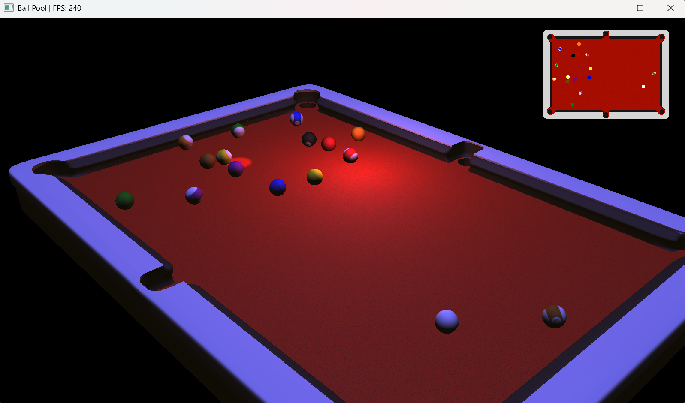

## About
This project was developed as part of the **3D Programming** course of the
**Bachelor in Digital Game Development Engineering** of the **Polytechnic Institute of Cávado and Ave (IPCA)**.

The goal was to use OpenGL to render a 3D scene of a billiard game, implementing features such as:
- Loading meshes and materials from OBJ and MTL files.
- Toggleable lighting from multiple light sources.
- A minimap of the scene.
- Some kind of animation - for this project, a physics system was implemented to achieve this.
- Manipulating the orientation of the scene through mouse input.
  - Note: Manipulating the scene instead of the camera was a specific requirement for this project.

### Roose
- Requires at least OpenGL version 4.5.
- Uses DSA (Direct State Access) functions whenever possible.
- Capable of reading and compiling GLSL shaders (vertex and fragment) from two separate files or a single file.
- Able to import more than one mesh and material per OBJ file.
- Performs a vertex deduplication when creating the Mesh after importing an OBJ.
- Uses three (3) **Uniform Buffers** (UBO) to facilitate the use of different shaders and
reduce the number of `glUniform*` function calls.
  - **Camera Uniform Buffer** - contains camera data (View-Projection matrix and camera position).
  - **Model Uniform Buffer** - contains model data (Model matrix).
  - **Material Data Uniform Buffer** - contains material data (diffuse, specular, etc.).
- The main class, as described in the project statement, is the `RenderableObject` class.
  - Each `RenderableObject` has its own VAO, VBO, and IBO.

### Ball Pool
- Since the 16 billiard balls share the same mesh, only one OBJ file for a ball is imported,
and the others are copied from the first and their material changed (by importing each individual MTL file).
Thus, all 16 billiard balls share the same `RenderableObject`, i.e., the same VAO, VBO, and IBO.
- Features a small physics system that allows the balls to move and collide with each other in a realistic way.

#### Controls:
- **Mouse movement**: Rotates the scene.
- **Mouse scroll**: Zooms the camera in/out.
- **[ SPACE ]**: Applies a force to the cue ball.
- **[ R ]**: Resets the position of the balls.
- **[ 1 ]**: Toggles ambient lighting on/off.
- **[ 2 ]**: Toggles directional lighting on/off.
- **[ 3 ]**: Toggles point lighting on/off.
- **[ 4 ]**: Toggles spot lighting on/off.
- **[ CTRL ] + [ 1 ]**: Changes the ambient light color to a random color.
- **[ CTRL ] + [ 2 ]**: Changes the directional light color to a random color.
- **[ CTRL ] + [ 3 ]**: Changes the point light color to a random color.
- **[ CTRL ] + [ 4 ]**: Changes the spot light color to a random color.
- **[ SHIFT ] + [ 1 ]**: Changes the ambient light color to white.
- **[ SHIFT ] + [ 2 ]**: Changes the directional light color to white.
- **[ SHIFT ] + [ 3 ]**: Changes the point light color to white.
- **[ SHIFT ] + [ 4 ]**: Changes the spot light color to white.
- **[ ALT ]**: Hold to enable the cursor. Useful for resizing the window.
- **[ CTRL ] + [ ENTER ]**: Toggles between windowed and fullscreen mode.
- **[ ESC ]**: Exits the program.

<p align="center">
<picture></picture>
</p>

## Building

Visual Studio 2026 or JetBrains Rider is recommended.

#### 1. Downloading the repository
Start by cloning the repository with:
```
git clone --recurse-submodules https://github.com/BrunoMoreira99/P3D-TP
```
If you already cloned the repository without the `--recurse-submodules` flag, you can still initialize and update the
submodules by running:
```
git submodule update --init --recursive
```

#### 2. Generating the project files
To generate project files, you should use [**premake5**](https://premake.github.io/).\
Place the `premake5` executable in `vendor/premake/bin` and run any of the **GenerateProjects** scripts.\
Or do it manually by placing the `premake5` executable in the root directory of the project and running the following
command:
```
premake5 vs2026
```

#### 3. Building the project
Open the generated solution file in your IDE and build the Ball Pool project.
